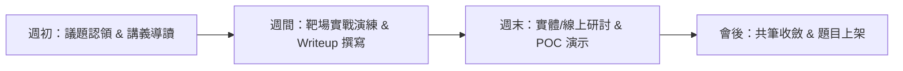

# 資安研討與實戰讀書會 (Security Study Group & Training Platform)

歡迎來到資安研討與實戰培訓平台！本專案旨在透過**理論研討（Theory Reading）**與**沙盒靶場實作（Hands-on CTFd Labs）**並行之雙軌機制，協助成員系統化掌握現代資訊安全攻防技術。

---

## 🎯 讀書會核心目標

1. **理論與規範扎根**：深入研讀網路協定、現代密碼學原理、二進位程式結構與常見漏洞弱點（CWE / OWASP Top 10）。
2. **靶場實作驗證**：利用專案內建之 CTFd 靶場環境與自研外掛，親手重現、分析與修補各類資安題目。
3. **高密度知識沉澱**：透過結構化共筆與漏洞分析報告（Writeup），培養團隊協作、逆向工程與安全審查能力。

---

## 🔄 運作流程與研討機制

讀書會採**每週固定研討週期**，每週運作節奏如下：

### 1. 角色分工
- **主講人 (Presenter)**：負責該週技術主題導讀、投影片或概念講解，並引導 Lab 題目解題思維。
- **紀錄官 (Scribe)**：記錄研討過程中的關鍵提問、非預期解法（Unintended solutions）與共筆整理。
- **演練評測員 (Lab Reviewer)**：負責維護本機或伺服器端 CTFd 題目狀態，驗證動態 Flag 與環境可用性。

### 2. 研討結構
- **30 min - 核心觀念導讀**：原理剖析（RFC、原始碼分析、安全架構）。
- **45 min - 靶場實戰拆解**：現場 Live-demo 或題目 Walkthrough，示範工具操作（Burp Suite, Ghidra, pwntools 等）。
- **15 min - 深入研討與安全防禦**：討論漏洞根因、修補機制（Mitigation）與安全開發實務。

---

## 🛠️ CTFd 實戰演練與靶場模組

本專案將 CTFd 定位為手把手演練的沙盒模組：
- **`plugins/dynamic_shuffle_flag/`**：防作弊動態 Flag 外掛，提供檔案即時修補與差異化題目交付。
- **`challenges/`**：收錄跨平台逆向工程、Web 弱點、密碼學與二進位漏洞實戰題目。
- **`database/ctfd_dump_2026.sql`**：提供一鍵還原演練環境的完整題目與使用者基線。

---

## 📝 共筆與 Writeup 規範

所有成員撰寫的每週心得、題目 Writeup 與技術研究，請統一置於 `study/weeks/` 對應週次中，格式請參考 [study/weeks/README.md](weeks/README.md)。

### 規範要點：
- **可重現性 (Reproducibility)**：Writeup 必須詳述測試環境、漏洞觸發步驟（PoC 腳本）與完整輸出截圖。
- **根因剖析 (Root Cause Analysis)**：不單記錄 Payload，更需說明「為什麼漏洞會產生」以及「開發端該如何修復」。
- **負責任揭露與道德守則 (Ethics & Responsible Disclosure)**：嚴禁將研究手法或工具用於非授權之目標系統，恪守資安道德標準。
